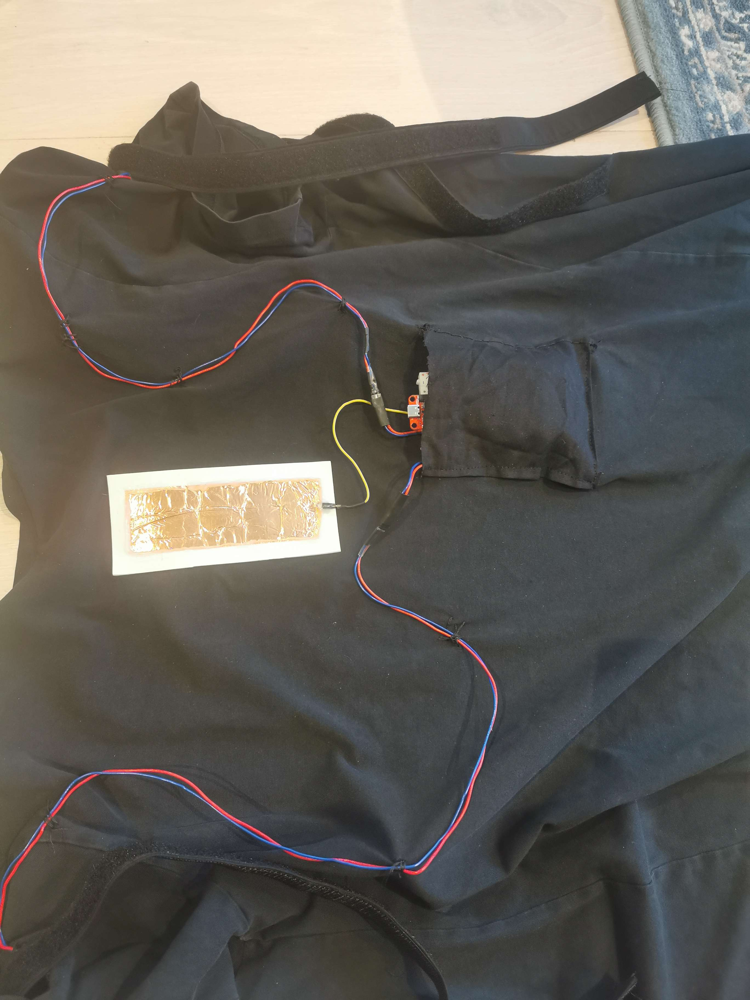

# Feel The Edge

## -- Catchy slogan or a logo or poster for the project --
**-- POSTER? --**

---

## Introduction

Feel The Edge is an educational VR experience designed to help users deal with different distractions by simulating multiple audio and visual triggers, all while they are in a safe environment.

This experience focuses on people with **Anxiety Disorder** and **sensory hypersensitivity**, especially those sensitive to sounds and lights.

The experience is especially valuable to these users, as they can adapt to an environment filled with multiple audio and light triggers, which are usually very challenging for them. All of these triggers are introduced in a **safe environment**.

When users feel uncomfortable or reach their limit, they can change the level of distractions or stop the experience by pressing the **panic button** attached to their chest, which will suspend the experience and transport them to a comforting scene.

---

## Design Process

The Design Process started with a **brainstorming session**, where each of us tried to think of as many problems, ideas, and solutions as possible, covering various disabilities, and solutions that could be completed within the given timeframe.

Afterward, each team member presented one idea to the classroom and received feedback on which option was the most logical to proceed with.

Once the project idea was decided, the team discussed the project purpose and the experience itself. This discussion helped build the **Design Document**, which included a timeline for each week.

---

### Persona

To better understand people with sensory hypersensitivity, the team browsed through articles to learn about the challenges our target group faces in everyday life, how they feel about it, and how they cope with it. 

The **persona** was created from the information gathered, with the goal of addressing their needs and pain points, and making decisions and solutions based on an imaginary person.

**-- PERSONA --**
**-- PAIN POINTS --**
**-- USER JOURNEY? --**

After this process, the team identified key problems and developed solutions for how the whole experience would look. The solution is an experience designed to help users practice their stability while being distracted by objects and sounds that typically cause anxiety.

The team envisioned a **Safe Space** and Environment where users can manipulate different options and find or increase their threshold level.

---

### Classroom

This would be achieved by using a menu where the user could activate disturbing sounds, trigger lights that flicker, and control the people in the room and their movement—challenges identified as particularly problematic for these individuals.

---

### Safe Space, Emergency Button, Tactile Feedback

For safety, the safe space environment is where users enter once they press the **emergency button** attached to their chest. 

Users also have the option to control the **tactile feedback** they receive on their shoulders when someone approaches them in VR.

---

### User Testing

The demo version of the experience was presented and tested by several people, providing us valuable feedback to improve the experience. Based on this feedback, we adjusted our presentation of how the experience would look, as well as made minor changes to gameplay and UI elements (such as the Menu) to make the experience smoother for users.

---

## System Description

### Features

Feel The Edge includes the following features:

- A **virtual classroom environment** where users can control their surroundings, such as adjusting the level of sound, light flickering, and controlling people’s movements.
- An **easily accessible emergency button** that leads users to the Safe Space if they feel uncomfortable and wish to stop the experience.
- **Simulation of people walking near you**, where vibration motors activate when people walk close to you.

---

#### Watch the DEMO VIDEO or try out the live version by [this GitHub Repository](https://github.com/ernestoagc/su-det-2025-group-1)

---

## Installation
#### This can be inspiration how this part should look - https://gitea.dsv.su.se/ExtralityLab/DET24-AtomCraft
To install and run Feel The Edge on your platform or device, follow the instructions below:

| **Platform** | **Device**     | **Requirements**                               | **Commands**                                                                 |
|--------------|----------------|------------------------------------------------|-----------------------------------------------------------------------------|
| Windows      | Meta Quest     | Unity 2022.3 or higher, Arduino               | `git clone https://github.com/user/repo.git` `cd project-xr` `open MainScene.unity` `Build and Run` |
| Android      | Phone          | Android 19 or higher, ARCore 1.18 or higher   | `git clone https://github.com/user/repo.git` `cd solar-system-xr` `open SolarSystemXR.unity` `switch platform to Android` `build and run` |

You also need to install the following dependencies or libraries for your project:

- **Library A** – a Unity plugin for building VR and AR experiences
- **Library B** – a C# wrapper for speech recognition and synthesis

---

## Usage

To use Feel The Edge and interact with its features, follow the guidelines below:

1. The game is stationary and uses hand tracking. Get yourself comfortable, preferably sitting.
2. Open Feel The Edge on your VR headset.
3. Read the instructions and press the Start button using the poke gesture.
4. Once in the Classroom, start the experience by clicking the buttons on your left hand. These buttons will change the environment around you.
5. Listen and look at what's happening around you, and try to increase the level of distractions once you feel comfortable with the current level.
6. If you feel uncomfortable or wish to stop the experience, press the button on your chest to be transported to the Safe Space.

---

## References

Acknowledge here the sources, references, or inspirations that you used for your project. Give credit to the original authors or creators of the materials that you used or adapted for your project (3D models, source code, audio effects, etc.)

---

## Contributors

Evgeniia Dolgikh  
evdo4579@student.su.se
[Linkedin](https://www.linkedin.com/in/evgeniiadolgikh/)

Antonio Jerkovic  
anje7074@student.su.se  
[Linkedin](https://www.linkedin.com/in/antonio00232/)

Ernesto Galarza  

Florian Unger  
flun4103@student.su.se
